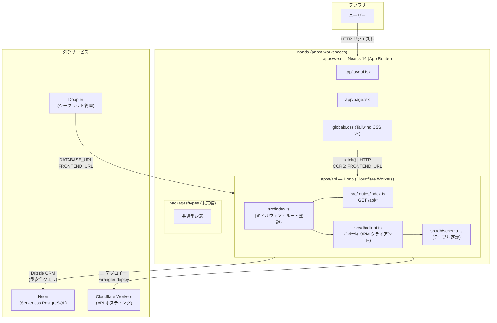
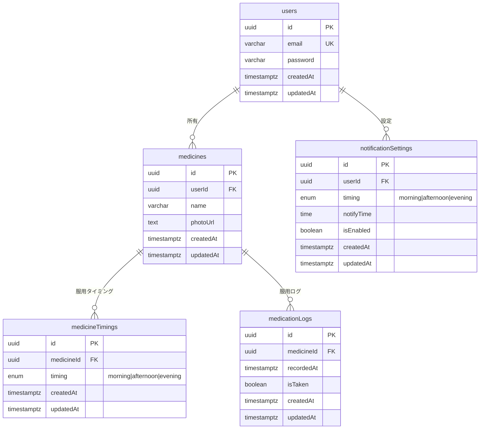
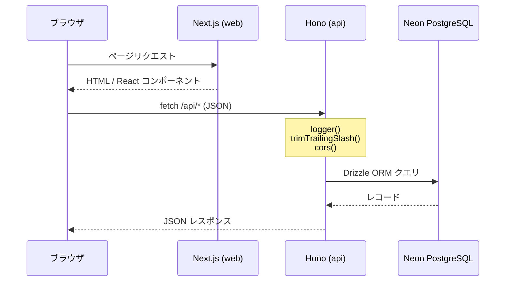
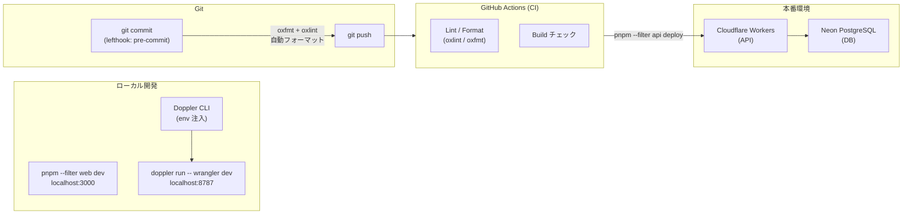

# Nonda アーキテクチャ図

## システム全体

```mermaid
graph TB
    subgraph Browser["ブラウザ"]
        User["ユーザー"]
    end

    subgraph Monorepo["nonda (pnpm workspaces)"]
        subgraph Web["apps/web — Next.js 16 (App Router)"]
            Layout["app/layout.tsx"]
            Page["app/page.tsx"]
            CSS["globals.css (Tailwind CSS v4)"]
        end

        subgraph API["apps/api — Hono (Cloudflare Workers)"]
            Index["src/index.ts\n(ミドルウェア・ルート登録)"]
            Routes["src/routes/index.ts\nGET /api/*"]
            DbClient["src/db/client.ts\n(Drizzle ORM クライアント)"]
            Schema["src/db/schema.ts\n(テーブル定義)"]

            Index --> Routes
            Index --> DbClient
            DbClient --> Schema
        end

        subgraph Types["packages/types (未実装)"]
            SharedTypes["共通型定義"]
        end
    end

    subgraph External["外部サービス"]
        Neon["Neon\n(Serverless PostgreSQL)"]
        Cloudflare["Cloudflare Workers\n(API ホスティング)"]
        Doppler["Doppler\n(シークレット管理)"]
    end

    User -->|"HTTP リクエスト"| Web
    Web -->|"fetch() / HTTP\nCORS: FRONTEND_URL"| API
    API -->|"Drizzle ORM\n(型安全クエリ)"| Neon
    API -->|"デプロイ\nwrangler deploy"| Cloudflare
    Doppler -->|"DATABASE_URL\nFRONTEND_URL"| API
```

## データベーススキーマ

```mermaid
erDiagram
    users {
        uuid id PK
        varchar email UK
        varchar password
        timestamptz createdAt
        timestamptz updatedAt
    }

    medicines {
        uuid id PK
        uuid userId FK
        varchar name
        text photoUrl
        timestamptz createdAt
        timestamptz updatedAt
    }

    medicineTimings {
        uuid id PK
        uuid medicineId FK
        enum timing "morning|afternoon|evening"
        timestamptz createdAt
        timestamptz updatedAt
    }

    medicationLogs {
        uuid id PK
        uuid medicineId FK
        timestamptz recordedAt
        boolean isTaken
        timestamptz createdAt
        timestamptz updatedAt
    }

    notificationSettings {
        uuid id PK
        uuid userId FK
        enum timing "morning|afternoon|evening"
        time notifyTime
        boolean isEnabled
        timestamptz createdAt
        timestamptz updatedAt
    }

    users ||--o{ medicines : "所有"
    users ||--o{ notificationSettings : "設定"
    medicines ||--o{ medicineTimings : "服用タイミング"
    medicines ||--o{ medicationLogs : "服用ログ"
```

## リクエストフロー（API）

```mermaid
sequenceDiagram
    participant Browser as ブラウザ
    participant Web as Next.js (web)
    participant API as Hono (api)
    participant DB as Neon PostgreSQL

    Browser->>Web: ページリクエスト
    Web-->>Browser: HTML / React コンポーネント

    Browser->>API: fetch /api/* (JSON)
    Note over API: logger()<br/>trimTrailingSlash()<br/>cors()
    API->>DB: Drizzle ORM クエリ
    DB-->>API: レコード
    API-->>Browser: JSON レスポンス
```

## 開発・デプロイフロー

```mermaid
graph LR
    subgraph Local["ローカル開発"]
        Dev1["pnpm --filter web dev\nlocalhost:3000"]
        Dev2["doppler run -- wrangler dev\nlocalhost:8787"]
        Doppler2["Doppler CLI\n(env 注入)"]
        Doppler2 --> Dev2
    end

    subgraph CI["GitHub Actions (CI)"]
        Lint["Lint / Format\n(oxlint / oxfmt)"]
        Build["Build チェック"]
    end

    subgraph Prod["本番環境"]
        CF["Cloudflare Workers\n(API)"]
        NeonProd["Neon PostgreSQL\n(DB)"]
    end

    subgraph Git["Git"]
        Commit["git commit\n(lefthook: pre-commit)"]
        Push["git push"]
    end

    Commit -->|"oxfmt + oxlint\n自動フォーマット"| Push
    Push --> CI
    CI -->|"pnpm --filter api deploy"| CF
    CF --> NeonProd
```
